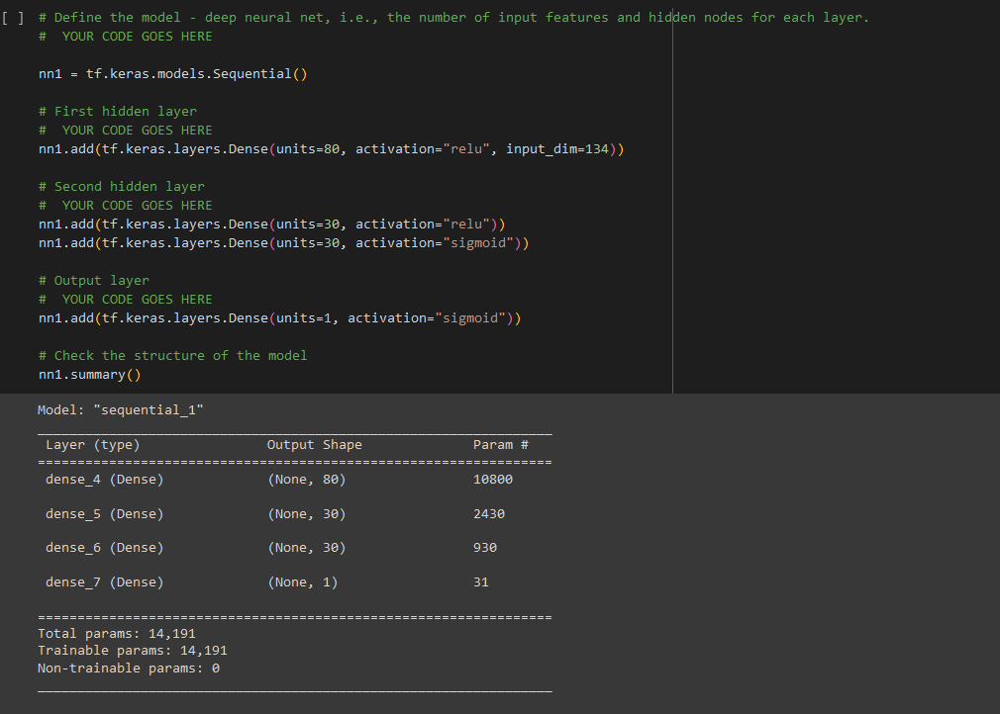
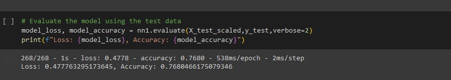

# deep-learning-challenge

## Overview

This analysis was used to create a model to predict whether or not an organization which receives funding from the Alphabet Soup charity will succesfully complete their project or not.

## Results

* Data Prepocessing
  * The target variable in this analysis is 'IS_SUCCESFUL'
  * The feature variables are:
    * 'NAME'
    * 'APPLICATION_TYPE'
    * 'AFFILIATION'
    * 'CLASSIFICATION'
    * 'USE_CASE'
    * 'ORGANIZATION'
    * 'INCOME_AMT'
    * 'ASK_AMT'
  * The feature variables that were removed from the dataset are:
    * 'EIN'
    * 'STATUS'
    * 'SPECIAL_CONSIDERATIONS'

* Compiling, Training, and Evaluating the Model
  * The optimized model had three hidden layers, the first of which had 80 units, the second and third of which had 30 units. The first two used the 'relu' activation and the third used the 'sigmoid' activation.
  * I was able to achieve a model accuracy of 76.8%, exceeding the goal of 75%.
  * I took the following steps to increase the performance of the model:
    * First, I analyzed the value_counts of the remaining columns that had not been analyzed in the first model.
    * I saw that two of the columns - 'ORGANIZATION' and 'STATUS' were almost universally the same value, this providing little room for the model to distinguish whether or not these variables could predict the success of a funding project.
    * I removed these two variables from the dataset, but this had a relatively minimal impact on the accuracy of the model.
    * I then added a third hidden layer with a different activation than the first two, this similarly had a minimal impact on the model.
    * Finally, I decided to look at the variables that we had excluded from the initial model. I saw that there were a large number of names that had multiple applications, as well as there being many that had very few.
    * I decided to include this variable in the model for any name that had applied for 25 or more loans. 
    * I then changed the model to train over 150 epochs.
  
    * After this, the accuracy increased  from 72% to 76%.

## Summary
Overall, the model was fairly succesful at predicting whether or not a funding project would completely succesfully or not. Further refinement could be done by continuing to tweak the cutoff points for the variables that had rare results. 
